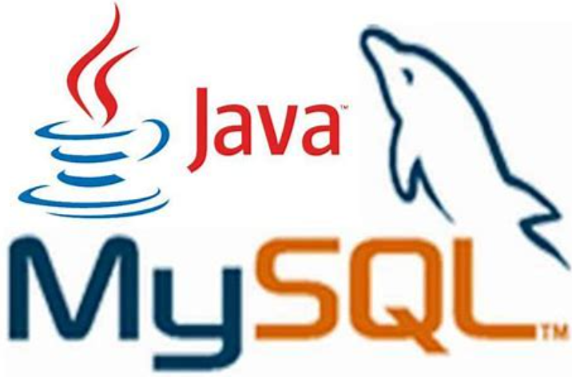

# Create Webapp for Car Rental Vendor to track Trip and expenses using Java and MySQL

# Framework/Languague : Java 
# Technology Components : Appservice , Azure Database for Mysql , Azure Container registry, Github Actions Workflow

# In this Lab , we are performing following tasks using Github Action

  1. Create Azure services with Github Actions Workflow
  2. Build Container Image and push to container registry
  3. Configure MySQL Database 
  4. Update Mysql Database schema/Data as code
