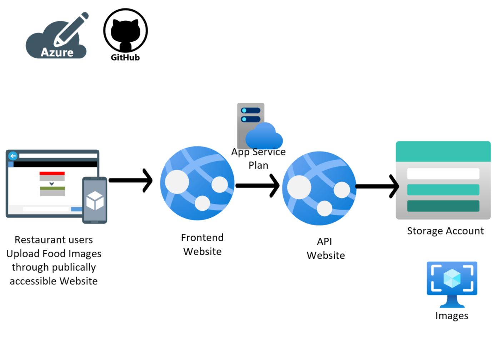

# Github Actions Lab on Fast Food Restaurant

## Architecture Diagram

## Instructions Netcore Hands on Labs with Github Actions

1. Review Source code and Workflow file and do appropriate naming changes to reflect your Azure services
2. Create Azure Services using Github Actions Workflow by editing SERVICECREATE.md file
3. Make note of Access key for storage account and record this in Github Secret "STORAGECONNECTIONSTRING"
4. Modify buildanddeploy.md file to Build and Deploy netcore code
5. Verify Webapp and API app running file by browsing this website
6. Upload Food Images to check functionality of Website
