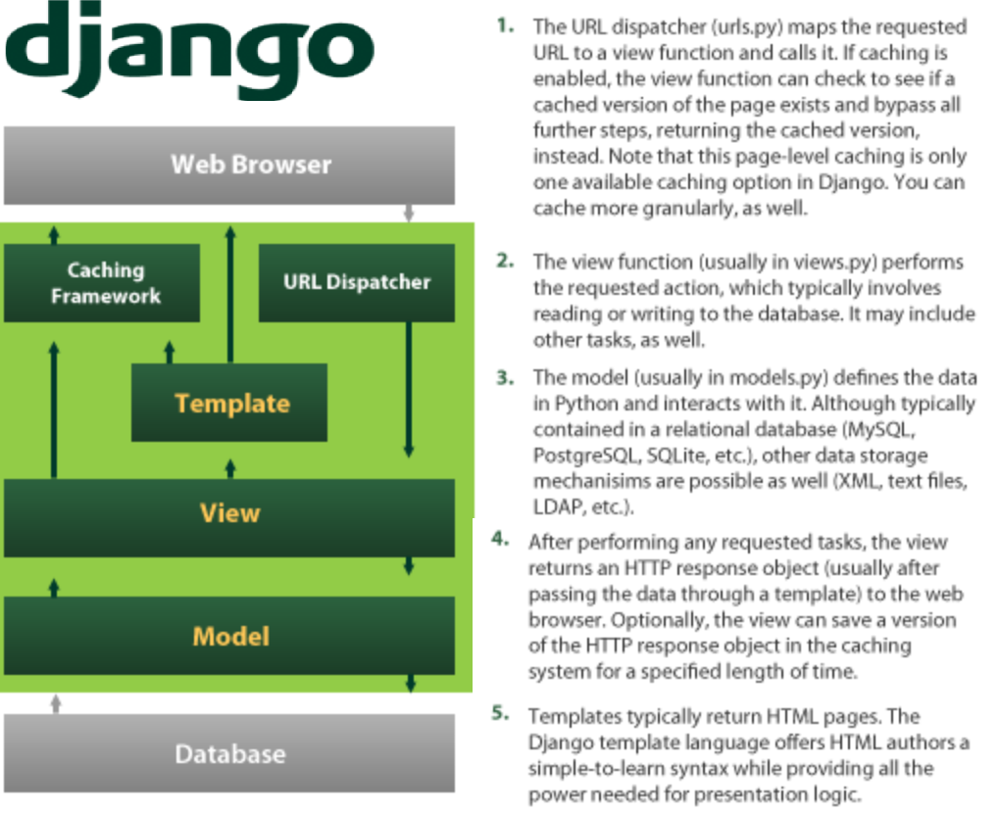

# Create your Own Polls using Django and PostgreSQL Database

# Functional working diagram of Django framework

# In this Lab, we are automating following tasks using Github Actions.

  1. Create Azure services with Github Actions Workflow
  2. Build and configure App service and Postgresdb 
  3. Update Postgres Database schema/Data as code
